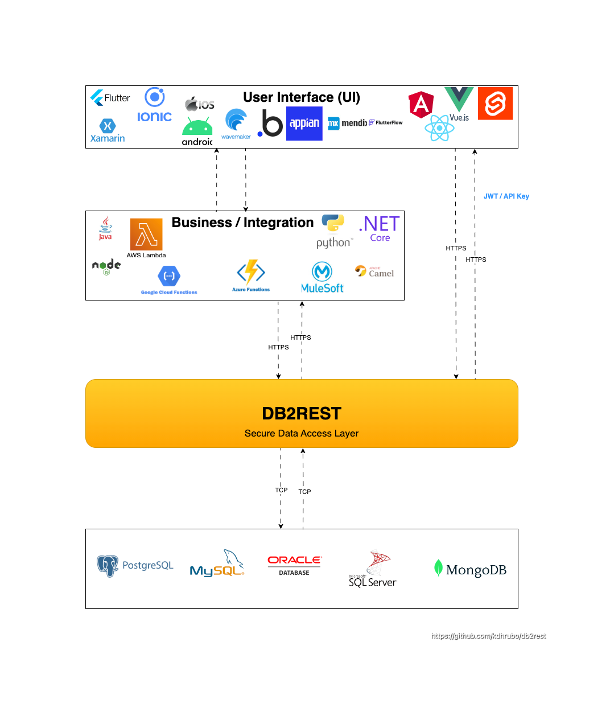

DB2Rest is an **open-source tool** to rapidly build data access layer with minimal engineering effort. 
DB2Rest connects with your database to instantly provide REST API to perform data access operations(create, read, insert, update) and execute stored functions/procedures. 
Thus, DB2Rest can provide significant boost to your application delivery as it takes care of all data access logic and associated best practices. 

Additionally, you can also use DB2Rest as a database gateway for legacy databases. This allows secure REST API based access to data for partners and internal developers. 
This can simplify many file or direct database access based data sharing - thus opening up possibilities of rapid integration and innovation. 

:star: If you find DB2Rest useful, please consider adding a star on GitHub! Your support motivates us to add new exciting features.


[](https://github.com/kdhrubo/db2rest/issues)
[](https://github.com/kdhrubo/db2rest/stargazers)


[](https://github.com/kdhrubo/db2rest)

[](https://twitter.com/db2rest)


<p align="center">
  <a href="https://db2rest.com" target="blank"></a>
</p>


# Support

*Connect on Discord*

[](https://discord.gg/gytFPNW656)


# Contact

<help@db2rest.com>


# How does it work?




The diagram above shows an application architecture with DB2Rest. DB2Rest provides secure access to the database as REST API within seconds of installation/deployment. 
The business logic can be written in your favorite technology frameworks for Java, PHP, Node, .NET, or using any serverless framework. The business logic layer uses the database access layer (DBAL) provided
by DB2Rest to query and modify data. The user experience layer can be developed using popular front-end frameworks or low-code/no-code platforms. This layer can make use of the business logic layer or directly access secure data layer provided by DB2Rest.

## Benefits

    - No code, no SQL knowledge required, instead use simple REST Query Language (RQL) to retrieve data.
    - Accelerate application development by 30x. 
    - Unlock databases - secure REST API access for legacy data.
    - Blazing fast - No ORM, Single SQL Statement, 1 Database round-trip, does not use code generation.
    - Support for advanced custom queries, bulk data insert, and remote stored procedure calls. 
    - Best practices for transaction management, connection pooling, encryption, security - RBAC / data entitlement.
    - Deploy and run anywhere - on-premise, VM, Kubernetes, or any cloud. 
    - Zero downtime - adjusts to your evolving database schema. 
    - Compatible with DevOps processes. 


# Installation 

## On Premise / On Virtual Machines (VM) 

Refer to [installation quickstart documentation](https://db2rest.com/docs/intro).


## With Docker

Refer to [installation quickstart documentation](https://db2rest.com/docs/installation-running-with-docker).


# Supported Databases

- **PostgreSQL**
- **MySQL**

# Supported Features

**Save Record (Create)**

- [x] Single record.
- [x] Bulk records.

**Query (Read)**

- [x] Row Filtering with rSQL DSL.
- [x] Column Selection
- [x] Rename Columns / Alias
- [x] Join - Inner
- [x] Include Join Columns
- [x] Pagination - Limit & Offset
- [X] Sort / Order by
- [ ] Group By
- [ ] Count
- [ ] Join column filter


**Edit**

- [x] Patch
- [x] Patch with row filtering


**Purge (Delete)**

- [x] Delete with row filter.
- [x] Safe delete.

**Transactions**

- [x] Readonly for Select
- [x] Supported for Save, Edit, Purge 

**Multi-tenancy**

- [ ] Tenant Id column
- [x] Schema per tenant
- [ ] Database per tenant

**Schema Support**

- [x] Multiple schema support


# Request parameters for Pagination

| Parameter Name | Description                                               | 
|----------------|-----------------------------------------------------------|
| page           | Page you want to retrieve, 0 indexed and defaults to 0.   | 
| size           | Size of the page you want to retrieve, defaults to 20.    | 

# Request parameters for Sorting

| Parameter Name | Description                                               | 
|----------------|-----------------------------------------------------------|
| sort           | Properties that should be sorted by in the format property,property(,ASC|DESC). Default sort direction is ascending. Use multiple sort parameters if you want to switch directions, e.g. ?sort=firstname&sort=lastname,asc.  | 


# Examples 

**1. Get all Actors**
   
This will retrieve all the rows and columns from the database. Avoid if the table has large number of rows, use pagination instead.

**cURL**

```Shell
curl --request GET \
  --url http://localhost:8080/actor \
  --header 'Accept-Profile: sakila' \
  --header 'User-Agent: insomnia/8.4.5'
```
**HTTPie**

```Shell
http GET http://localhost:8080/actor \
  Accept-Profile:sakila \
  User-Agent:insomnia/8.4.5
```


**2. Get all Actors with Column Filter**
   
This will retrieve all the rows but *only the speficied columns* from the database. Avoid if the table has large number of rows, use pagination instead.

**cURL**

```Shell
curl --request GET \
  --url 'http://localhost:8080/actor?select=actor_id,first_name,last_name' \
  --header 'Accept-Profile: sakila' \
  --header 'User-Agent: insomnia/8.4.5'
```
**HTTPie**

```Shell
http GET 'http://localhost:8080/actor?select=actor_id,first_name,last_name' \
  Accept-Profile:sakila \
  User-Agent:insomnia/8.4.5
```


**3. Get all Actors with Row Filter**

This will retrieve all the rows with specified columns or all columns from the database. However this will also filter out rows based on the filtering criterias specified in the *filter* request
parameter. The filter uses RSQL - REST SQL format. The query below retrieves 2 columns 'first_name', 'last_name' from 'actor' table if the 'first_name' is 'PENELOPE'. 

**cURL**

```Shell
curl --request GET \
  --url 'http://localhost:8080/actor?select=actor_id,first_name,last_name&filter=first_name==PENELOPE' \
  --header 'Accept-Profile: sakila' \
  --header 'User-Agent: insomnia/8.4.5'
```
**HTTPie**

```Shell
http GET 'http://localhost:8080/actor?select=actor_id,first_name,last_name&filter=first_name==PENELOPE' \
  Accept-Profile:sakila \
  User-Agent:insomnia/8.4.5
```


**4. Get all Actors with Column Alias**
   
Use the colon separator `:` to map a column to an alias.  This will retrieve all the rows and columns from the database. Avoid if the table has large number of rows, use pagination instead.
This query shows how to change column name in the response JSON using Alias. 

**cURL**

```Shell
curl --request GET \
  --url 'http://localhost:8080/actor?select=actor_id:id,first_name:firstName,last_name:lastName' \
  --header 'Accept-Profile: sakila' \
  --header 'User-Agent: insomnia/8.4.5'
```
**HTTPie**

```Shell
http GET 'http://localhost:8080/actor?select=actor_id:id,first_name:firstName,last_name:lastName' \
  Accept-Profile:sakila \
  User-Agent:insomnia/8.4.5
```


**5. Get all Films Released in the year 2006 along with Language**

This will retrieve all the rows for the films released in 2006 along with its language for audio. 
DB2Rest is smart and detects the inner join relation between 'film' and 'language'.

**cURL**

```Shell
curl --request GET \
  --url 'http://localhost:8080/film?select=film_id:id,title,description,release_year:yearOfRelease&filter=release_year==2006&join=language[]' \
  --header 'Accept-Profile: sakila' \
  --header 'User-Agent: insomnia/8.4.5'
```
**HTTPie**

```Shell
http GET 'http://localhost:8080/film?select=film_id:id,title,description,release_year:yearOfRelease&filter=release_year==2006&join=language[]' \
  Accept-Profile:sakila \
  User-Agent:insomnia/8.4.5
```

*Note the square brackets are mandatory for join table.*


**6. Get all Films Released in the year 2006 along by Film Language with Join table fields**

The GET query above does not fetch the join table fields. The join table fields can be retrieved in the same way as the root table fields as shown below. 

```Shell
curl --request GET \
  --url 'http://localhost:8080/film?select=film_id:id,title,description,release_year:yearOfRelease&filter=release_year==2006&join=language[select=language_id:langId,name]' \
  --header 'Accept-Profile: sakila' \
  --header 'User-Agent: insomnia/8.4.5'
```
**HTTPie**

```Shell
http GET 'http://localhost:8080/film?select=film_id:id,title,description,release_year:yearOfRelease&filter=release_year==2006&join=language[select=language_id:langId,name]' \
  Accept-Profile:sakila \
  User-Agent:insomnia/8.4.5
```


**7. Get all Films Released in the year 2006 in English**

TODO


**8. Insert Records**

Refer to [insert documentation](https://db2rest.com/docs/category/insert-records).


**10. Update record with filter**

This PATCH operation updates the film with id = 1001 which was inserted earlier. Filter is optional. In this case it will update all the rows in the table. Hence, use PATCH update with care.

```Shell
curl --request PATCH \
  --url 'http://localhost:8080/film?filter=film_id%3D%3D1001' \
  --header 'Content-Profile: sakila' \
  --header 'Content-Type: application/json' \
  --header 'User-Agent: insomnia/8.4.5' \
  --data '{
	
	"rental_rate" : 1.99,
	"length" : 92
	
}'
```
**HTTPie**

```Shell
echo '{
	
	"rental_rate" : 1.99,
	"length" : 92
	
}' |  \
  http PATCH 'http://localhost:8080/film?filter=film_id%3D%3D1001' \
  Content-Profile:sakila \
  Content-Type:application/json \
  User-Agent:insomnia/8.4.5
```


**11. Delete Records**

Refer to [delete documentation](https://db2rest.com/docs/category/delete-records).


**13. Offset pagination**

This GET operation will fetch results of the query in chunks of pages - 2 records at a time.

```Shell
curl --request GET \
  --url 'http://localhost:8080/actor?select=actor_id,first_name,last_name&filter=first_name=="PENELOPE"&page=0&size=2' \
  --header 'Accept-Profile: sakila' \
  --header 'User-Agent: insomnia/8.4.5'
```
**HTTPie**

```Shell
http GET 'http://localhost:8080/actor?select=actor_id,first_name,last_name&filter=first_name=="PENELOPE"&page=0&size=2' \
  Accept-Profile:sakila \
  User-Agent:insomnia/8.4.5
```


**14. Sorting with Offset pagination**

This GET operation will fetch results of the query in chunks of pages - 2 records at a time and sorted.

```Shell
curl --request GET \
  --url 'http://localhost:8080/actor?select=actor_id,first_name,last_name&filter=first_name=="PENELOPE"&page=0&size=2&sort=actor_id&sort=first_name,DESC' \
  --header 'Accept-Profile: sakila' \
  --header 'User-Agent: insomnia/8.4.5'
```
**HTTPie**

```Shell
http GET 'http://localhost:8080/actor?select=actor_id,first_name,last_name&filter=first_name=="PENELOPE"&page=0&size=2&sort=actor_id&sort=first_name,DESC' \
  Accept-Profile:sakila \
  User-Agent:insomnia/8.4.5
```


# Roadmap

Refer to [open roadmap](https://db2rest.com/roadmap/) items.
