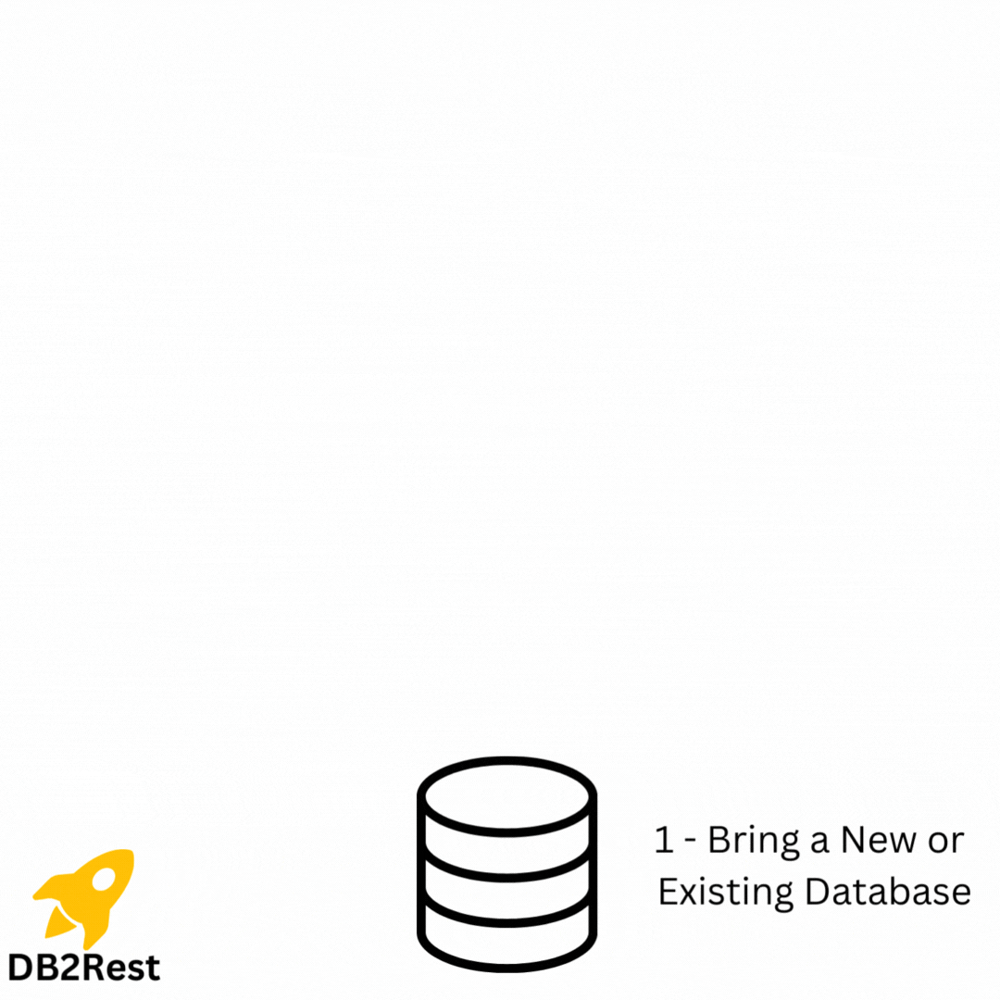

DB2Rest is an **open-source DATA API platform** that provides REST API over databases in minutes.
It takes care of all the boilerplate data access logic and best practices, thus freeing up development team to focus on building 
complex business logic and intuitive user interfaces. :airplane:

DB2Rest simplifies development of data-intensive intelligent applications. :bulb:
It connects (traditional and ML enabled)databases and AI services(OPENAI, AWS Bedrock) to provide Web APIs to load AI models, ingest data, perform database queries with natural language, and quickly share insights and data with other applications. 

:star: If you find DB2Rest useful, please consider adding a star on GitHub! Your support motivates us to add new exciting features.

# How does it work?

# Use Cases 

## Accelerate Application Delivery with Instant REST DATA API

DB2Rest provides instant REST API(no code generation) to boost development by 30x. Low code and best practices are built-in saving engineering teams
months of effort and cost. 

## Faster Innovation with Secure AI Gateway

DB2Rest works hand in glove with modern AI powered databases, LLM implementations to provide consistent Web APIs to deliver smart applications.
Low code AI integration, natural language query and visualization, ability to execute tasks allows faster innovation. DB2Rest can function 
as centralized AI gateway providing governance, metrics 

## Simplify Integration

DB2Rest works as a secure database gateway. This helps enterprises to open up data to internal developers and partners in a safe and agile way which was not possible earlier. 
Complex and maintenance-heavy file-based data exchange can be replaced with DB2Rest. Applications can be loosely coupled by reducing direct database based integration. 

## Easy Database DevOps and Documentation

Evolve database structures at speed with DB2Rest DML support. DB2Rest provides database visualization, diagramming, linting and diff.

# Installation 

[On premise / On Virtual Machines installation guide](https://db2rest.com/docs/intro).

[Docker based installation guide](https://db2rest.com/docs/installation-running-with-docker).

# Supported Databases

- **PostgreSQL**
- **MySQL**
- [PostgreML](https://postgresml.org/) : March 2024 - release
- **Tembo** : March 2024 - release
- **Neon** (Planned)
- **Nile** (Planned)
- **MindsDB** 
- [KDB](https://kdb.ai/)
- [Zilliz](https://zilliz.com/)
- [AstraDB](https://www.datastax.com/products/datastax-astra)
- [Vespa](https://vespa.ai/)
- **Oracle** (Coming soon)
- **MariaDB** (Coming soon)
- **MS SQL Server** 
- **CockroachDB**
- **Yugabyte**
- **AWS RDS Postgres**
- **AWS RDS MySQL**

# Support

*Connect on Discord*

# Contact

<help@db2rest.com>

{::comment}
# Roadmap

Refer to [open roadmap](https://db2rest.com/roadmap/) items.

{::/comment}
